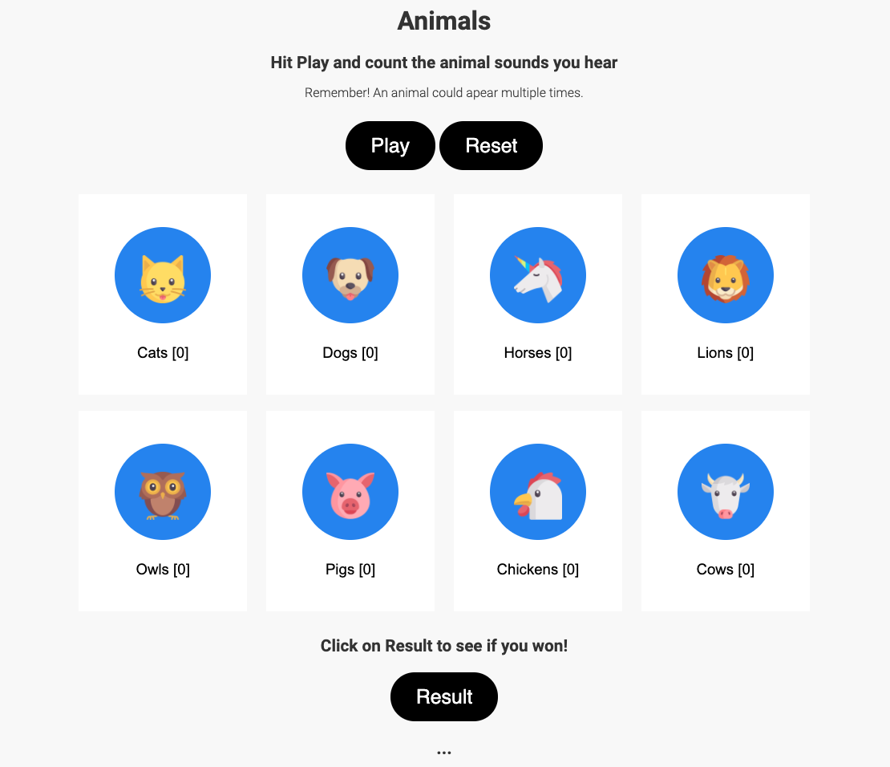

# Animals
`Animals` is an interactive audio interface suitable for children between ages 2 - 8 to learn about animals.

Picture books with animal characters are very popular among younger children. Children also love to observe animals in real life. However at the moment they cannot make visits to their local library for books or to the zoo for seeing animals in real life due to COVID-19 restrictions around the world. `Animals` aims to fill this gap by providing a platform for children to learn about animals in a safe online environment. 

## Usage
To get started click on the `Play` button to hear 10 randomly selected audio snippets of animal sounds. The goal is to correctly count the number of times you hear an animal sound by clicking on the animal's icon every time you hear the sound. At the end, click on `Result` to see if you won or lost. Click `Reset` to reset the animal counts.

Note: there are 8 animals in total, so an animal sound could be heard mutliple times.

## Journey
This project was inspired by virtual assistants such as Amazon Alexa that play animal sounds for children. `Animals` takes this feature one step further by allowing children to interactively identify different animals. Here are the steps I took for building this project:

1. Made a rough sketch of the user interface.
2. Created the structure of the webpage using HTML.
3. Gathered the required audio and image assets. Ainmal sounds were downloaded from Google, e.g. https://www.google.com/logos/fnbx/animal_sounds/dog.mp3 and animal images were downloaded from https://www.flaticon.com/.
4. Added styling and animations to the page using CSS.
5. Used JS to implement the functionality and logic for playing the audio files, counting the animals, and evaluating the counts to see if the user won or lost.

## Future Work
- Add buttons for each animal to allow for both count down and count up in case the user makes a mistake and wants to count down an animal.
- Allow the user to set the difficulty level. The levels can be normal, easy, and difficult and they can be set by adjusting the playback rate and the pause between each animal sound.
- Allow the user to set the number of animal sounds that are randomly played. At the moment it is set to 10 sounds.
- Let the user know which animal(s) they have miscounted in the results.
- Add more animals to the page using [this](https://en.wikipedia.org/wiki/List_of_animal_sounds) comprehensive list of animal sounds on Wikipedia.